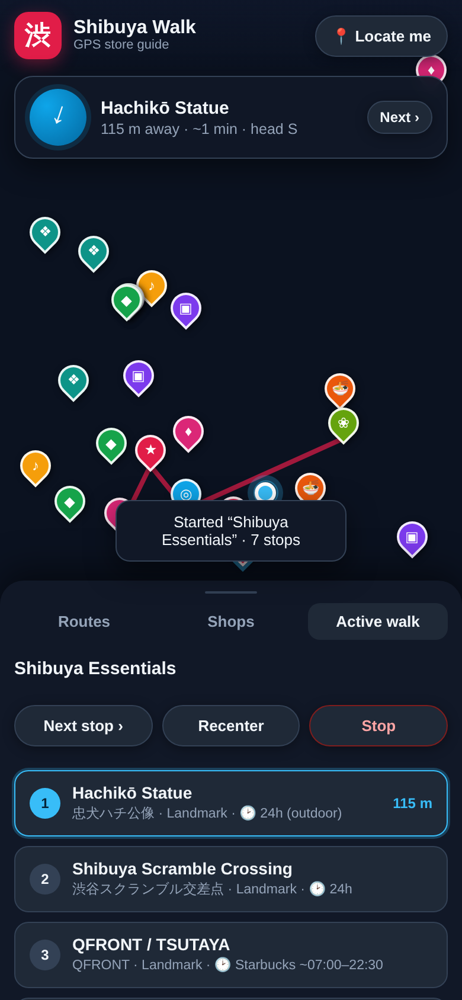
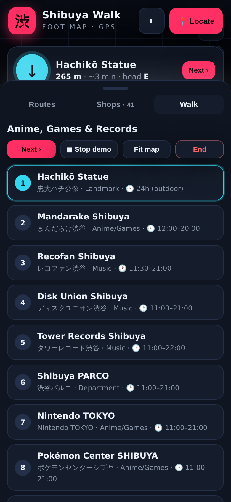
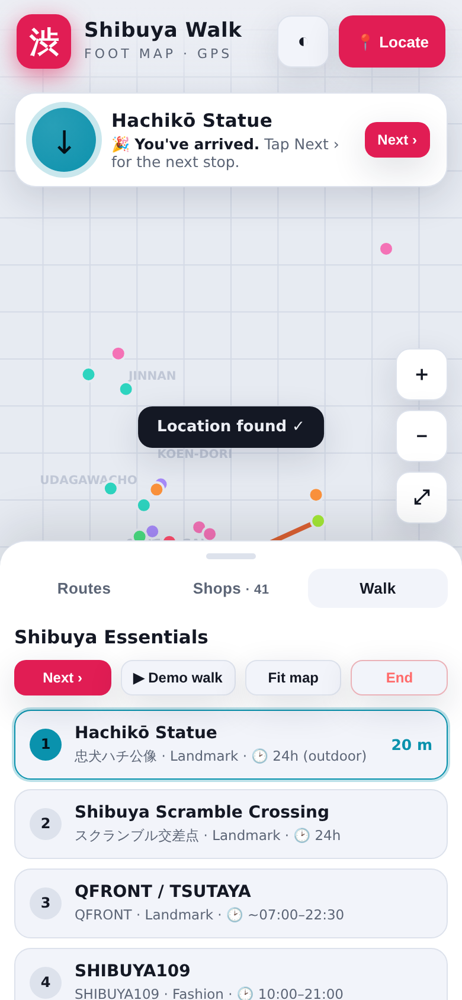

# 渋 Shibuya Walk — GPS store guide

A mobile-first web app that walks you around **Shibuya, Tokyo**. It shows your
live GPS position on a map, plots curated stores/landmarks with details, and
gives you **turn-toward-target guidance** (distance, walking time, and a compass
arrow) along suggested walking routes.



*(Map tiles appear blank in this capture because it was taken in an offline
sandbox — they load normally once the app is served with internet access.)*

## Features

- 🗺️ **Live map** (Leaflet + OpenStreetMap) centered on Shibuya.
- 📍 **GPS tracking** — your location + accuracy circle, updated as you move
  (uses the browser Geolocation API, `watchPosition`).
- 🧭 **Live guidance** — for the current target it shows distance, estimated
  walking minutes, and an arrow that **rotates with your phone's compass**
  (device-orientation) so you know which way to walk.
- 🧾 **Curated store data** — ~28 notable Shibuya spots: department stores,
  fashion, electronics, record shops, anime/game stores, food alleys, viewpoints
  and landmarks. Each has Japanese name, category, description, typical hours and
  an insider tip.
- 🛣️ **Suggested routes** — 4 themed walks (Essentials, Anime/Games/Records,
  Shopping Spree, Food & Nightlife). Each draws a route line, tracks your current
  stop, and auto-shows the next one when you tap **Next**.
- 🔎 **Filter + sort** — filter shops by category; when GPS is on the list sorts
  **nearest first** with live distances.

## Run it

It's a static site — no build step, no dependencies to install. But because it
uses GPS and loads map tiles, it must be served over **HTTP(S)**, not opened as a
`file://` URL. Browsers only grant geolocation on `https://` or `http://localhost`.

```bash
cd shibuya-walk
python3 -m http.server 8000
# then open http://localhost:8000 on your computer
```

To use it **on your phone with real GPS**, host it somewhere with HTTPS
(GitHub Pages, Netlify, Vercel, Cloudflare Pages, etc.) and open the URL on the
phone. Example with GitHub Pages: enable Pages for this repo and point it at the
`shibuya-walk/` folder, or drop the folder into any static host.

> On iPhone, tap **📍 Locate me** once — Safari requires a user tap before it
> will ask for location and compass permission.

## How the guidance works

- Distance uses the **haversine** formula between your GPS fix and the target.
- Direction uses the **initial bearing**; it's shown as a cardinal hint (e.g.
  "head NE") and as an arrow.
- If the device exposes a compass heading (`deviceorientationabsolute` /
  `webkitCompassHeading`), the arrow points to the target **relative to the way
  you're facing** — turn until the arrow points straight up, then walk.
- Straight-line legs are drawn on the map (dashed blue = you → current stop,
  red = the full route). This is intentionally simple and dependency-free; it
  points you toward each stop rather than doing full street-level turn-by-turn.

## Files

```
shibuya-walk/
├── index.html      # markup + Leaflet CDN
├── css/styles.css  # dark, mobile-first UI
└── js/
    ├── data.js     # CATEGORIES, SPOTS (store data), ROUTES
    └── app.js      # map, GPS, guidance, routes, UI
```

## Customising / adding stores

Add or edit entries in `js/data.js`:

```js
{
  id: "my-shop",
  name: "My Shop",
  jp: "マイショップ",
  category: "fashion",          // must match a key in CATEGORIES
  lat: 35.6600, lng: 139.6990,
  desc: "One-line description.",
  hours: "10:00–21:00",
  tip: "Something useful.",
}
```

Build a new route by listing spot `id`s in order under `ROUTES`.

## Where the shop data comes from

Two builds, one dataset model:

- **`js/data.js`** — a hand-curated seed of ~28–40 high-signal Shibuya spots
  (accurate coordinates, JP names, hours, tips). Always available offline.
- **`js/osm-shops.js`** — the *full* set, generated from **OpenStreetMap** via the
  **Overpass API** by `scripts/fetch-shops.mjs`. This is the production data
  source: free, no API key, redistributable under the ODbL, and it carries
  name / coordinates / shop type / `opening_hours` / `website` for hundreds of
  Shibuya businesses.

```bash
# Regenerate the full OSM dataset (needs internet):
node scripts/fetch-shops.mjs
#   → writes js/osm-shops.js  (window.OSM_SHOPS = [...])
# Custom area or a mirror endpoint:
node scripts/fetch-shops.mjs --bbox 35.653,139.693,35.670,139.708
OVERPASS_URL=https://overpass.kumi.systems/api/interpreter node scripts/fetch-shops.mjs
```

Both the Leaflet app and the artifact merge `window.OSM_SHOPS` on top of the seed
when it's present, so adding the file "upgrades" the app to full coverage with no
code change.

**Data-source options compared**

| Source | Cost | Key | Coverage in Japan | Redistribute? |
| --- | --- | --- | --- | --- |
| **OpenStreetMap / Overpass** (used here) | Free | None | Very good | Yes (ODbL, attribute) |
| Google Places API | Paid | Yes | Best | No (terms restrict storage) |
| Foursquare Places | Free tier | Yes | Good | Limited |
| HERE / Mapbox POI | Paid | Yes | Good | Limited |

To switch to Google Places instead, replace the Overpass query in
`scripts/fetch-shops.mjs` with a Nearby Search + Place Details loop and map the
`types[]` to the app's categories — the rest of the app is unchanged.

## The artifact build (`artifact.html`)

`artifact.html` is a **single, fully self-contained** version published as a
claude.ai Artifact. Artifacts run under a strict Content-Security-Policy that
blocks all network requests, so it can't load map tiles or call an API at
runtime. Instead it:

- **draws its own vector map on `<canvas>`** — POIs and your GPS dot are plotted
  from real WGS84 coordinates, so distances, bearings and route lines stay
  metrically accurate even without street tiles;
- **bakes the curated dataset in**, and still merges `window.OSM_SHOPS` if you
  concatenate the generated file ahead of it when self-hosting;
- **degrades gracefully for GPS**: it tries `navigator.geolocation`, and if the
  sandboxed frame blocks it you can **tap the map to set your location** or run a
  **Demo walk** that animates along the active route.




For real street tiles + live GPS in production, host the Leaflet app
(`index.html`) — that's the build meant to run in a normal mobile browser.

## Notes & accuracy

- Coordinates are hand-curated and approximate (good to a few metres). Opening
  hours are typical values and change on holidays — check before a special trip.
- Map tiles © OpenStreetMap contributors. For heavy/production use, switch to a
  tile provider you're licensed for (Leaflet makes this a one-line change in
  `index.html`/`app.js`).
- Everything runs client-side; no location data leaves your device.
